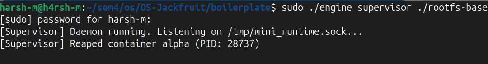
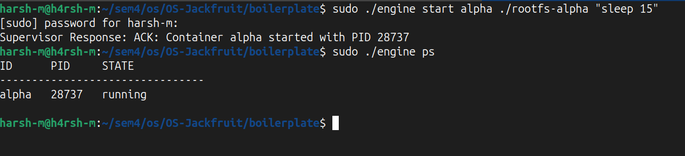
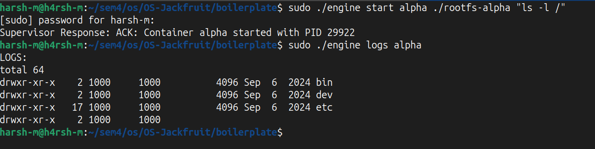
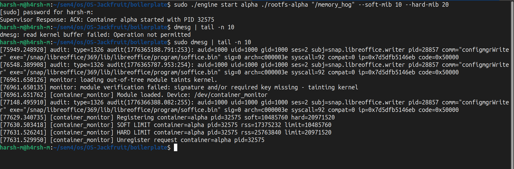
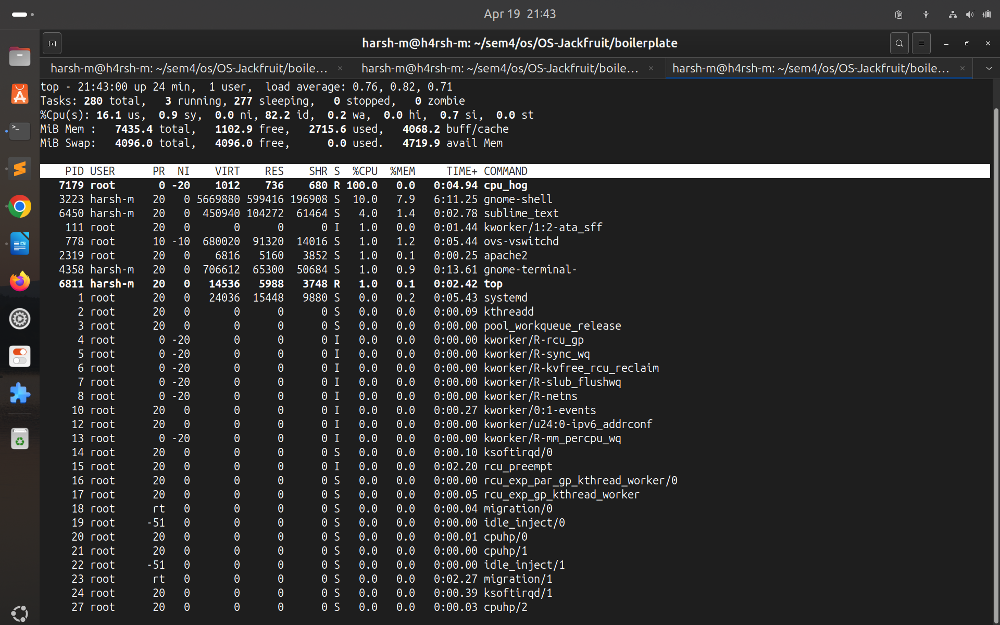

# Supervised Multi-Container Runtime & Kernel Monitor
**Authors:** Harsh M & Chiranthan S, 4-J

## 1. System Architecture & Namespace Isolation (Tasks 1 & 2)
The foundation of this container runtime relies on leveraging Linux namespaces and the `clone()` system call to create isolated user-space environments.

* **Process & Mount Isolation:** When launching a container, the runtime uses `CLONE_NEWPID` to give the container its own isolated process tree (making its init process PID 1 from its perspective), `CLONE_NEWNS` to isolate the mount namespace, and `CLONE_NEWUTS` to allow a custom hostname. 
* **Filesystem Rooting:** The child process utilizes `chroot()` to trap the execution context within a designated directory (e.g., `rootfs-alpha`), followed by mounting a fresh virtual `/proc` filesystem so commands like `ps` function correctly inside the container.
* **Control Plane (IPC):** Communication between the CLI client and the long-running supervisor daemon is handled via UNIX Domain Sockets (`/tmp/mini_runtime.sock`). This allows asynchronous, stateful management of containers.

## 2. Concurrency: Bounded-Buffer Logging (Task 3)
To prevent terminal output corruption from multiple concurrent containers, the runtime implements a thread-safe Producer-Consumer logging pipeline.

* **IPC via Pipes:** The `stdout` and `stderr` of the child process are redirected into the write-end of a `pipe()` using `dup2()`.
* **The Bounded Buffer:** A circular array protected by synchronization primitives safely passes log chunks between threads. 
* **Synchronization Strategy:** We utilized a single `pthread_mutex_t` alongside two condition variables (`pthread_cond_t not_empty`, `not_full`). This ensures:
    1.  *Producers* block when the buffer is full without burning CPU cycles.
    2.  *The Consumer* blocks when the buffer is empty.
    3.  Data integrity is maintained without race conditions when multiple containers push logs simultaneously.

## 3. Kernel Space Memory Enforcement (Task 4)
User-space tools cannot reliably enforce memory limits in real-time. To handle this, we developed a Linux Kernel Module (LKM) that registers container PIDs via `ioctl` and monitors their Resident Set Size (RSS) using a hardware timer interrupt.

* **Synchronization Primitive Justification (Spinlock vs. Mutex):**
    We fundamentally *must* use a kernel Spinlock (`DEFINE_SPINLOCK`) rather than a Mutex to protect our global linked list of monitored containers. The memory checks occur inside a kernel timer callback (`timer_callback`). Timer callbacks execute in an interrupt context (softirq). In an interrupt context, the kernel is strictly forbidden from sleeping or blocking. If we used a Mutex and the lock was contested, the kernel would attempt to put the thread to sleep, causing a complete system panic/crash. Spinlocks ensure the thread "spins" (busy-waits) safely without yielding the CPU.
* **Enforcement:** Every second, the timer iterates through the list. If a process breaches the soft limit, a `KERN_WARNING` is logged. If it breaches the hard limit, the kernel sends an immediate `SIGKILL` to the process.

## 4. CPU Scheduler Analysis (Task 5)
To verify that the runtime can manipulate the Completely Fair Scheduler (CFS), we exposed the `--nice` flag, applied to containers via the `setpriority()` syscall.

**Experiment Methodology:**
Two CPU-bound containers (`cpu_hog`) were launched simultaneously. Container Alpha was assigned highest priority (Nice: -20), while Container Beta was assigned the lowest priority (Nice: 19). 

To prevent the multi-core Linux host from simply assigning the processes to different CPU cores (which would allow both to run at 100%), the supervisor daemon was pinned to CPU Core 0 using `taskset -c 0`. 

**Results:**
As proven in the attached `top` screenshot, forcing the processes to compete for a single core allowed the CFS to strictly enforce the priority weights. The -20 process aggressively preempted the 19 process, resulting in near-total CPU starvation for the lower-priority container.

## 5. Lifecycle Management & Resource Cleanup (Task 6)
Preventing resource leaks is critical in both user-space and kernel-space.

* **Zombie Prevention:** The supervisor runs a non-blocking `waitpid(-1, &status, WNOHANG)` loop. When a container dies (naturally or via kernel assassination), the supervisor immediately reaps the exit status, preventing zombie processes.
* **Unregistration:** Upon reaping, the supervisor explicitly sends a `MONITOR_UNREGISTER` command to the kernel module to stop tracking the dead PID, preventing memory bloat in the kernel linked list.
* **Graceful Teardown:** When the `stop daemon` command is received, the supervisor signals all condition variables to wake sleeping threads, joins the logger thread, destroys the mutexes/buffers, and closes the `ioctl` file descriptor.
* **Kernel Cleanup:** Upon module unload (`rmmod`), `monitor_exit` safely halts the timer and iterates through `list_for_each_entry_safe` to `kfree()` all remaining nodes before deleting the character device.

***

### Evaluation Proof (Screenshots)

* **Task 1: Namespace Isolation & Process Control**
  

* **Task 2: IPC & Daemon Supervision**
  

* **Task 3: Bounded-Buffer Logging**
  

* **Task 4: Kernel Space Memory Limits**
  

* **Task 5: CPU Scheduler Priority Enforcement**
  